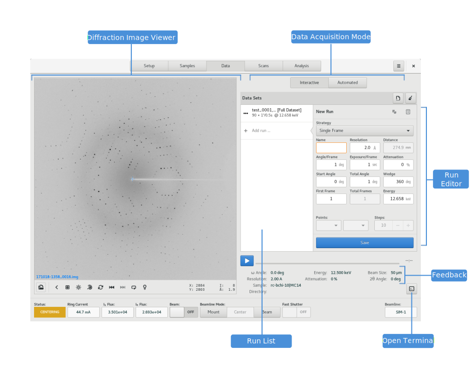

========
Analysis
========

.. contents:: Table of contents
    :depth: 1
    :local:

The Analysis View is the primary location for viewing data analysis reports and for initiating new data analyses
for acquired datasets.

    Analysis View

Data/Report List
----------------

Report Viewer
-------------

Initiating analysis Requests
----------------------------
