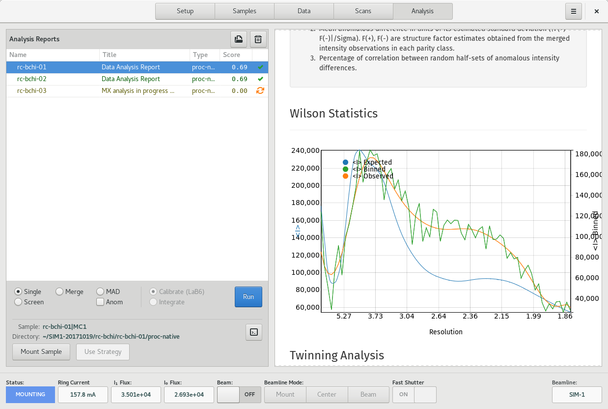

========
Analysis
========

.. contents:: Table of contents
    :depth: 1
    :local:

The Analysis View is the primary location for viewing data analysis reports and for initiating new data analyses
for acquired datasets.

    Analysis View

The view is divided into two regions, the Data/Report Table on the left, and the Report Viewer on the right.

Data/Report Table
-----------------
The Data/Report Table displays a Tree of datasets and corresponding analysis requests made against it. The analysis
rows display the name and type of dataset, the type of analysis requested, the analysis score if available,
and also the state of the analysis request, either pending, in-progress, completed or error.

To perform a new analysis, select a row on the table, then configure the analysis type using the controls below the
Data/Report Table. Finally, click the *Run* button to submit the request. For MAD and Merge data analysis types, it
is necessary to select multiple rows. This can be acheived by holding down the Ctrl- or Shift- keys while clicking on the desired rows.

Requests are submitted to the *Data Analysis Server* asynchronously, and the table is updated when the results are ready.

To view the analysis report, click on a row corresponding to a completed analysis request. The report is displayed in
the Report Viewer.

If a sample is associated with the current row of the table, selecting the row activates the *Mount Sample* button to
be used for mounting the given sample. Similarly, if a calculated data acquisition strategy is available, say as the result
of a screening analysis, clicking the row activates the *Use Strategy* button. Clicking this button will add an interactive
data  acquisition run on the Data page.

Report Viewer
-------------
The Report Viewer is a simple HTML browser used for displaying HTML reports. Right-click on the Viewer in order to access
available controls such as forward, back, stop and reload.

