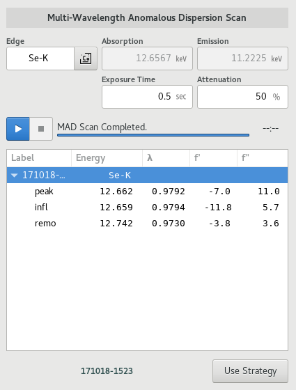

========
Scans
========

.. contents:: Table of contents
    :depth: 1
    :local:

The Scans View is the primary location for spectroscopic measurements such as MAD Scans, X-Ray fluorescence scans,
and X-Ray Absorption spectroscopy Scans.

.. figure:: scans.svg
    :align: center
    :width: 100%
    :alt: MxDC Scans View

    Scans View

Edge Selector
-------------
.. image:: edge-selector.png
    :align: center
    :alt: Edge Selector

Scan Plot
---------

.. image:: scan-plot.png
    :align: center
    :alt: Scan Plot

MAD Scans
---------

.. image:: mad-plots.png
    :align: center
    :alt: MAD Plots

XRF Scans
---------
.. image:: xrf-scans.png
    :align: center
    :alt: Sample Microscope

.. image:: xrf-plots.png
    :align: center
    :alt: XRF Plots

XAS Scans
---------
.. image:: xas-scans.png
    :align: center
    :alt: XAS Scan

.. image:: xas-plots.png
    :align: center
    :alt: XAS Plots

