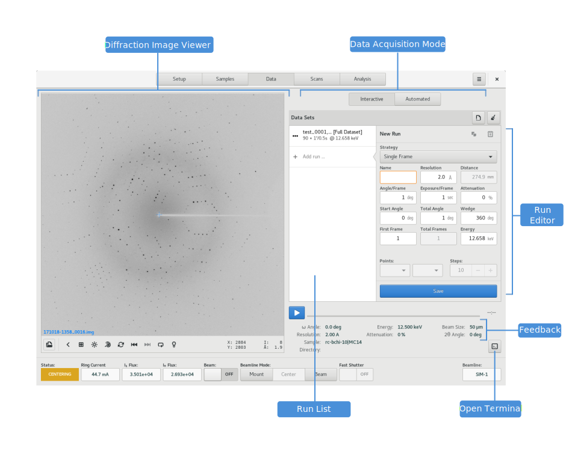

========
Data
========

.. contents:: Table of contents
    :depth: 1
    :local:

The Data View is the primary location for diffraction data acquisition.

    Data View

It supports both interactive and automated data acquisition.

Interactive Data Acquisition
----------------------------

Automated Data Acquisition
--------------------------

Diffraction Image Viewer
------------------------

