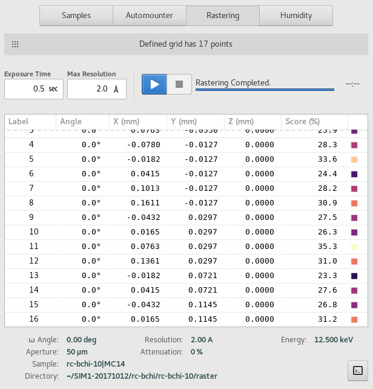
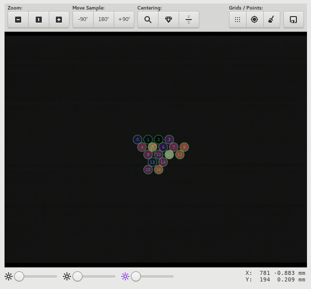

=======
Samples
=======

.. contents:: Table of contents
    :depth: 1
    :local:

The Samples View allows users to view their list of samples, select and mount samples, center samples in the beam,
perform diffraction cartography (rastering) and also control the sample environment, such as sample temperature
and humidity. The detailed feature available will depend on the specific capabilities of the beamline.

.. figure:: samples.svg
    :align: center
    :width: 100%
    :alt: MxDC Samples View

    Screenshot of the Samples View

Cryo Tool
---------
The cryo parameters are shown on the top-left hand corner of the Samples View. Values shown include, *temperature*,
*flow rates*, *cryogen fill level*. Where applicable, an annealing tool is also provided. To use the annealing tool,
set the annealing duration using the entry, and click the button to start annealing. The annealing operation can be
stopped at any time using the same button.

Immediately to the right of the cryo tool are additional device controls such as *goniometer omega rotation* and *beam
aperture*, which are often used in conjunction with the sample microscope.

Sample Microscope
-----------------
The sample microscope provides a video display of the sample position.

.. image:: sample-microscope.png
    :align: center
    :alt: Sample Microscope

At the top of the sample microscope
area is a toolbar with buttons for zooming, moving the sample, automated loop, crystal and capillary centering,
and finally buttons for defining rastering grids and saving points. Sample lighting adjustments can be made using
the tools at the bottom of the tool.

Single-click centering is available once the beamline is in the centering mode. In this mode, clicking on the image,
will attempt to move the centering stage such that the selected position is brought into the beam circle shown as a
red target overlaid on the video. The centered position can then be saved by clicking on the *Save Point*
icon on the toolbar.  Saved points are annotated on the video overlay.

To define a grid for rastering, click on the grid icon, and define a polygon enclosing the area you want to scan. A
valid polygon is a list of at least 3 points starting and ending at the same location. A line can be defined as
a polygon with 3 points only. Once the polygon is defined, a raster grid will be calculated for the specified region.

Points and grids can be cleared using the *Clear* icon on the toolbar.

Sample List
-----------
The sample list shows all on-site samples for the current user, as defined in the MxLIVE database.

Automounter Tool
----------------
The automounter tool shows a physical layout of containers loaded into the automounter, to allow selecting and
mounting samples by automounter location. This is not the recommended method of loading samples. Users should use the
the Sample List tool to select and mount samples by name.

.. image:: automounter.png
    :align: center
    :alt: Automounter Tool

Rastering Tool
--------------
The Rastering tool allow users to perform diffraction cartography on mounted samples, in order to identify locations
where the best diffraction can be obtained.

Results from the raster scan are also overlaid on the sample miscroscope.

Humidity Tool
-------------
The Humidity control tool allows users to perform controlled dehydration experiments on their samples at room temperature.

.

