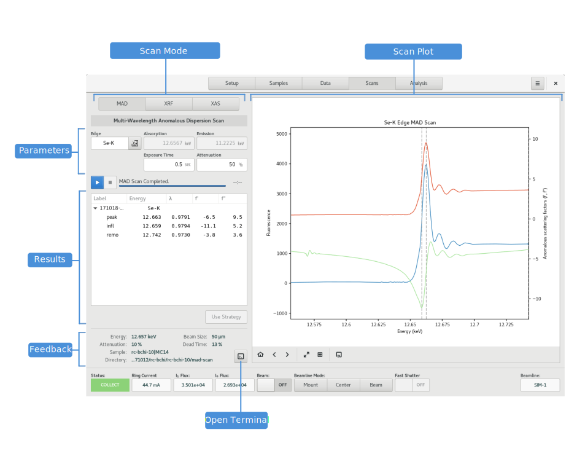

========
Scans
========

.. contents:: Table of contents
    :depth: 1
    :local:

The Scans View is the primary location for spectroscopic measurements such as MAD Scans, X-Ray fluorescence scans,
and X-Ray Absorption spectroscopy Scans.

    Scans View

MAD Scans
---------

XRF Scans
---------

XAS Scans
---------

Scan Plot
---------

