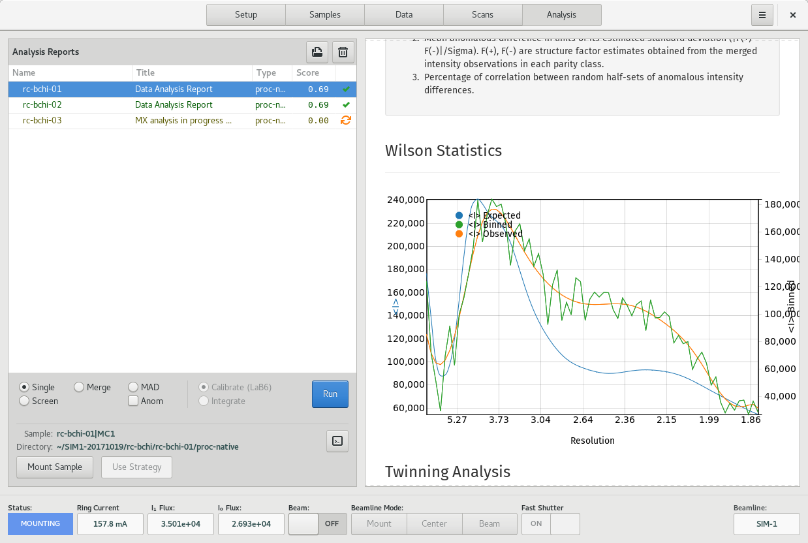

Analysis
========

The Analysis View is the primary location for viewing data analysis reports and for initiating new data analyses
for acquired datasets.

    Analysis View

The view is divided into two regions, the Data/Report Table on the left, and the Report Viewer on the right.

Data/Report Table
-----------------
The Data/Report Table displays a list acquired datasets grouped by sample. Corresponding analysis requests made against
each dataset are shown as clickable buttons to the right of the dataset row.
Each dataset row has a checkbox which can
be used to select datasets for further analysis.

The Analysis report buttons show the state of the analysis as an icon for in-progress
or failed requests.  Successfully completed requests are colored according to the score, ranging from red to green as the
score goes from 0.0 (worst) to 1.0 (best).

Additional analysis types can be performed per Sample by selecting the sample, checking all required datasets, configuring
the desired options to the left of the *Run* button, and then clicking the *Run* button to submit the request.  Note that
a single analysis will be performed with all the checked datasets included. This can be useful when merging multiple
datasets or for scaling separate datasets together durin MAD experiments. Only checked datasets within the selected sample
will be used in the analysis.

At this time, the available options are:

* Screen - Performs a screening characterization.
* Separate - For multiple datasets, process separately, but scale together at the end generating separate output files. For MAD.
* Anomalous - Process with Friedel's Law False.

Requests are submitted to the *Data Analysis Server* asynchronously, and the display is updated when the results are ready.

To view the analysis report, click on button corresponding to a completed analysis request. The report is displayed in
the Report Viewer on the right. For failed requests, clicking the report button will attempt to load a log file for inspection.

If a sample is currently associated with a position within the automounter, selecting the sample row activates the
*Mount Sample* button to be used for mounting the given sample. Similarly, if a calculated data acquisition strategy is
available within the currently display data analysis report, the *Use Strategy* button will be active. Clicking this button
will add an interactive data  acquisition run on the Data page.

Report Viewer
-------------
The Report Viewer is a simple HTML browser used for displaying HTML reports. Right-click on the Viewer in order to access
available controls such as forward, back, stop and reload.
