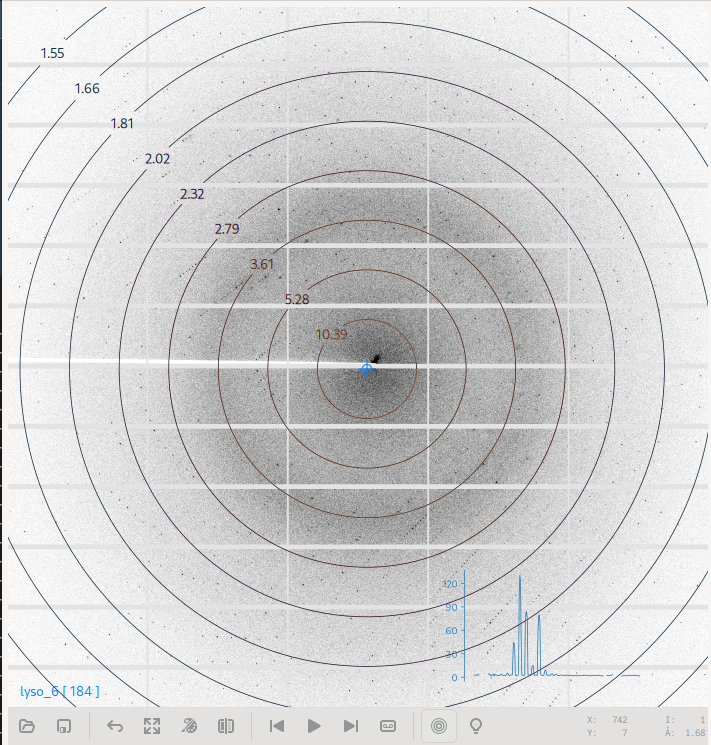

Data
====

The Data View is the primary view used for interactive, automated and rastering diffraction data acquisition.

The view is divided horizontally into two regions -- the Diffraction Image Viewer and the Data acquisition area, which
can be toggled between the *Interactive* , *Automated* or *Rastering* data acquisition tools.

Interactive Data Acquisition
----------------------------
The interactive data acquisition tool enables acquisition of one or more data sets using a variety of settings and
strategies on a single sample.

.. image:: images/interactive-data.png
    :align: center

The interactive data acquisition tool combines a dataset run list with a dataset run editor. To create a new dataset run, click
on the *Add run ...* row of the dataset list. A new run will be created and the editor will point to it. Alternatively,
while the editor is pointing to the *Add run ...* row, a new run can be created by updating the parameters and clicking
the *Save* button of the dataset editor.

To copy the parameters from an existing run, select the run from the list by clicking on it, and then click the copy icon
at the top of the run editor. To delete the run, click the Trash icon at the top of the run editor.

Once runs have been defined, click the start button to initiate acquisition of all defined runs. The run-icon will be
updated to indicate the state of the run -- either acquiring, complete or pending. Completed runs can be removed from
the list by clicking the clear button at the top of the page.

Completed runs will be ignored when the start button is clicked. To re-collect a completed run, select it and click
save button to reset its state to pending.

You will be prompted each time, if images exist that may be overwritten.

.. image:: images/data-existing.png
    :align: center

This may result if an acquisition operation was stopped or if a run is being re-collected. If continuing a stopped run,
choose the *Resume* option to resume data acquisition from where it stopped previously, and you want to preserve existing
data. Choose the *Start Over* option, if you want to overwrite the existing frames and start data acquisition afresh.

Click the stop button while acquisition is in progress to stop it.

.. note::
    Stopping data acquisition is exactly the same as Pausing it, thus there is no pause command. You can perform
    pause-resume cycles by stopping and then starting data acquisition, and selecting the *Resume* option when
    prompted.

    Data Acquisition pauses automatically if the beam is lost, and resumes again automatically once the beam is
    available.

Automated Data Acquisition
--------------------------
The automated data acquisition tool enables acquisition of datasets using the same set of parameters and strategy on
multiple samples in an automated manner.

The automated data acquisition tool combines a task sequence with a sample queue. To perform automated acquisition,
configure the sequence of tasks to perform, update the associated parameters, select the samples for the queue,
and then click the start button to start automation.

Samples can be selected by group, using the [ + ] button above the sample queue.
Alternatively, individual samples can be selected using the Sample List tool on the Samples page.

The first column of the sample queue displays an icon corresponding to the state of the sample, either pending, in
progress, or complete. Samples marked as completed, will be ignored each time the start button is clicked. They can be
removed from the list by clicking the clear button above the sample queue. To recollect on a previously collected sample,
make sure to re-select it, as collected samples are automatically deselected when complete.

Automation can be paused, resumed or stopped using the control buttons below the sample queue.

Rastering Data Acquitision
--------------------------
The Rastering tool allow users to perform diffraction cartography on mounted samples, in order to identify locations
where the best diffraction can be obtained. The rastering tool is integrated with the video microscope allowing
rastering parameters to be determined simply by drawing a grid on the sample video.  Alternatively, rastering
parameters can be directly provided using the rastering form fields.

.. image:: images/rastering.png
    :align: center
    :alt: Rastering Tool

To perform a run, update the parameters like exposure time and resolution settings, and then click the start button.
Results for each point of the raster scan are then displayed on the table, and are also overlaid on the sample miscroscope.

Data Set Parameters
-------------------
.. image:: images/data-parameters.png
    :align: center

Data set parameters can be configured using the dataset form for interactive data acquisition or through the
*Acquire frames* configuration tool for automated data acquisition. Note that some parameters may not be available
depending on the data acquisition mode.

The set of available parameters are described below:

.. glossary::

    Strategy
        The strategy is a drop down list used to select default parameters for specific types of experiments. It also
        determines whether/how acquired frames will be analysed. Available strategies
        strategies are:

        .. glossary::

            Single Frame
                Acquire a single frame

            Full Dataset
                Acquire a full dataset

            Screen ...
                Acquire a partial dataset for screening. Alternatives include frames at 0 and 90 degrees, frames at
                0, 45, and 90 degrees, or frames at 0, 45, 90 and 180 degrees.

            Powder
                Acquire a powder diffraction dataset.

    Directory Template
        This is actually a global preference which is also available through the MxDC preferences dialog. The value
        of this parameter determines how directories will be created to organize all acquired data in MxDC. It is
        highly recommended to use the default value.

    Name
        The name of the dataset, which will be used to create file names by appending the frame number and the file
        extension. This field should be unique when collecting multiple runs at once.

    Resolution
        The maximum diffraction resolution expected. This value determines the detector distance. In previous versions
        of MxDC, users were expected to provide the detector distance. Now the detector distance is calculated from the
        requested resolution, taking into consideration the energy and detector size.

    Angle/Frame (aka Delta)
        The angle range for acquiring a single frame

    Exposure/Frame
        The exposure time per frame. The exposure is linked to the Angle/Frame such that, the value will be adjusted
        automatically whenever the delta angle is changed, to preserve a constant exposure-rate.

    Attenuation
        The percentage of beam intensity to attenuate

    Start Angle
        The angular starting position for data acquisition

    Total Angle
        The total angle range to acquire. For screening datasets, the total angle determines the number of frames
        acquired for each contiguous slice within the screen.

    Wedge
        The wedge angle determines how much of a given run will be collected before proceeding to the next run when
        performing interleaved data collection strategies inverse beam or interleaved-MAD data acquisition. The
        default value of 360 degrees should be used otherwise. For example, to interleave 3 datasets A, B, C each into 3
        slices will result in the following data collection sequence: A1, B1, C1, A2, B2, C2, A3, B3, C3.  The wedge
        parameter can be different for each dataset but is not very meaningful if only collecting a single dataset at
        a time, unless the inverse beam parameter is active (see below). Also, the wedge parameter will be ignored if
        if it more than the total range of data collection.

    First Frame
        The index number of the first frame to be acquired. Usually 1. Subsequent frames will be numbered starting at
        this value. To continue a stopped data acquisition, do not change this value. Rather, use the *Resume* option
        when prompted at the start of data acquisition.

    Total Frames
        This field is not editable. It shows the total number of frames according to the defined parameters.

    Energy
        The data acquisition energy. By default this field is set to the current beamline energy.

    Inverse Beam
        In addition, collect the same amount of data already specified with an offset of 180 degrees. Use the wedge
        setting to interleave the direct and inverse portions of the dataset after a fixed data range in degrees.
        Dataset slices resulting from the inverse-beam option have priority over other slices resulting from the effect
        of the wedge parameter. Thus, inverse beam data slices will always be collected in pairs right after each other.
        For example for datasets A,B,C with inverse beam set only on A (e.g A'), if each dataset is sliced into 3 wedges
        based on the wedge parameter, the resulting sequence of data collection will be A1, A'1, B1, C1, A2, A'2, B2, ...
        etc.

    Points
        Enables selection of one or two saved points for data acquisition.  If a single point is selected, the sample
        will be moved to that point prior to data acquisition. If two points are selected, data will be collected
        at a number of positions between (and including) the selected points. The number of positions is
        determined by the value of the *Steps* parameter. This method of data acquisition is
        also known as *Vector Data Acquisition*. These parameters are not available in the automated data acquisition
        mode and are only enabled if saved points have been defined using the sample microscope on the Samples page.

    Steps:
        The number of steps to for *Vector Data Acquisition*. This parameter is only available if more than one point
        has been selected. It is not available in the automated data acquisition mode.

.. note::
    Linked parameters are re-evaluated and validated everytime a parameter changes. However, parameters are only applied
    once the save button is clicked.

Diffraction Image Viewer
------------------------
The diffraction image viewer is a full-featured viewer for diffraction images. All diffraction images collected within
MxDC are displayed on the same viewer. This includes images from interactive and automated data acquisition, rastering
and humidity control snapshots.

It is divided into the image area, which forms the bulk of the viewer, and a toolbar below the image area which provides
tools for opening new images, saving PNG representations of displayed patterns, a back button for returning to the
previous view, a tool for resetting the zoom, a pseudo-color toggle, a button for resetting the image, backward and
forward navigation buttons for stepping through frames in a dataset, a follow-frame toggle for automatically loading the
next frame in a sequence, and a button for displaying image header parameters.
The toolbar also displays detailed information about the current mouse position over the image,
such as pixel-coordinates, intensity and diffraction resolution.

Additional mouse gestures are available for manipulating the image.  For example, the scroll button of the mouse can be
used to adjust the brightness of the image. Left-clicking and dragging on the image will select a region of the image
to zoom into. Right-clicking and dragging will select a line along which to integrate and display a 2-dimensional
intensity profile. Middle clicking and dragging the image while zoomed-in pans the image.

The diffraction image viewer currently supports the following file formats:  CBF (full and Mini), MarCCD Tiff,
SMV (ADSC), RAXIS, Mar345, HDF5 and Nexus. In addition, XDS Spot and Reflection files can be loaded and overlaid on any
displayed image.