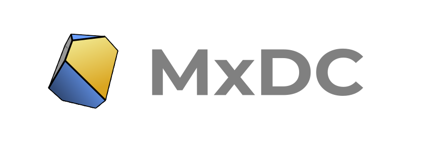

.. title::  MxDC - Macromolecular Crystallography Data Collector

MxDC (Macromolecular Crystallography Data Collector) is a software package for acquisition of
Macromolecular Crystallography data and related techniques at synchrotron beamlines. MxDC has
been developed since 2006 and has been the primary software for data acquisition and experiment
control at the Canadian Light Source Macromolecular Crystallography beamlines.  It is also
used at the Pohang Light Source II in South-Korea.

.. note::
    An earlier version of MxDC is described in the following publication:

    * MxDC and MxLIVE: software for data acquisition, information management and remote access to macromolecular
      crystallography beamlines. M. Fodje, K. Janzen, R. Berg, G. Black, S. Labiuk, J. Gorin and P. Grochulski
      J. Synchrotron Rad. (2012). 19, 274-280. https://doi.org/10.1107/S0909049511056305

Although developed primarily for MX beamlines, MxDC is based on an extensible generic framework that can be used
to develop data acquisition systems for different types of experiments and beamlines.

How to Use This Documentation
-----------------------------
This documentation is divided into three sections targeted at different audiences.  For MX beamline users
primarily interested in using the MxDC GUI for data acquisition, it is recommended to start with the  :doc:`overview`
section which describes the user interface. For beamline staff interested in installing and configuring MxDC for their
beamlines, start with the :doc:`installation` section.  Develpers interested in re-using or extending the MxDC framework should
consult the :doc:`api/purpose` section.

Index
-----

.. toctree::
    :caption: For MX Users
    :maxdepth: 1

    overview
    starting
    setup
    samples
    data
    scans
    analysis
    chat

.. toctree::
    :caption: For Beamline Staff
    :maxdepth: 1

    installation
    hutch
    console

.. toctree::
    :caption: For Developers
    :maxdepth: 1

    api/purpose
    api/objects
    api/devices
    api/engines
    api/services
    api/beamlines

