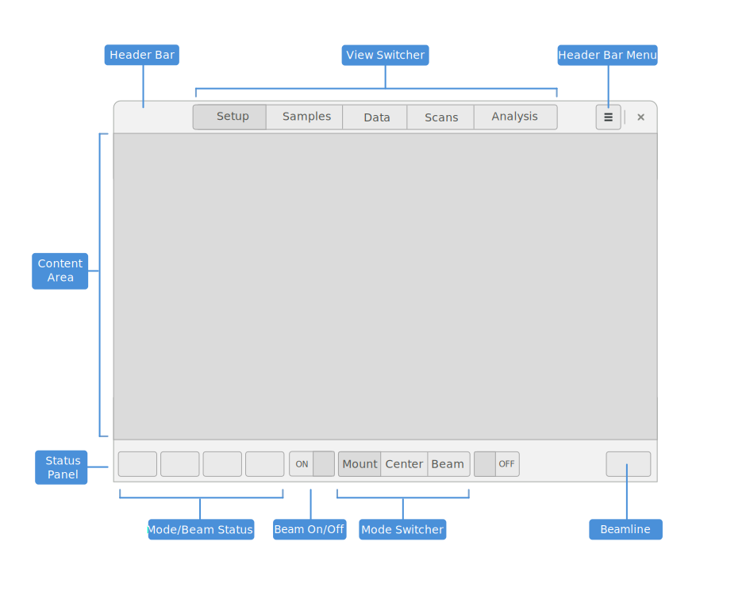
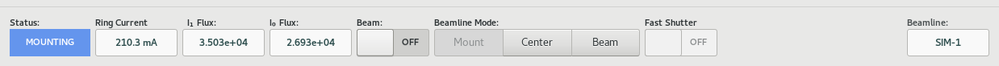

========
Overview
========

.. contents:: Table of contents
    :depth: 1
    :local:

About MxDC
----------

MxDC (Macromolecular Crystallography Data Collector) is a software package for acquisition of
Macromolecular Crystallography data and related techniques at synchrotron beamlines. MxDC has
been developed since 2006 and has been the primary software for data acquisition and experiment
control at the Canadian Light Source, Macromolecular Crystallography beamlines.  It is also
used at the Pohang Light Source in South-Korea.

MxDC is developed in the Python Programming Language, and makes use of GTK Toolkit library and the Twisted Network
Programming framework.

User interface
--------------
The MxDC user interface is organized into views, each focused on a specific type of activity. The View switcher on
the main application header bar can be used to switch between different views and also provides feeback on the
currently active view.  The Status Panel at the bottom of the application window is always visible.

    Overview of the MxDC User interface, showing the main components.

Status Panel
------------

The Status Panel at the bottom of the application window provides overall status information and global commands.
The labels at the top of the boxes help to identify the feedback or command.  From left to right the status panel
shows the beamline mode, the synchrotron ring current, live flux diagnostics, the Beam ON/OFF, the beamline
mode switch command buttons, the Fast Shutter ON/OFF switch, a status area for displaying the current operation,
and the beamline identifier for the current beamline.

    Screenshot of the MxDC Status panel

.. note::

   Based on the state of the beamline, and whether or not certain operations may be in progress, not all commands
   may available at all times. For example, the Beam ON/OFF switch can only be turned ON but is disabled when ON, to
   prevent inadvertent disruption of on-going experiments.

