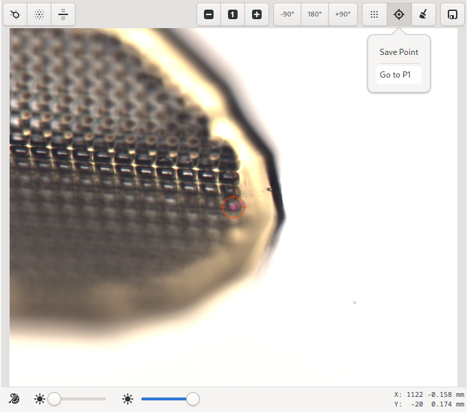

Samples
=======

The Samples View allows users to view their list of samples, select and mount samples, center samples in the beam,
perform diffraction cartography (rastering) and also control the sample environment, such as sample temperature
and humidity. The features available will depend on specific capabilities of the beamline.

.. figure:: images/samples.svg
    :align: center
    :width: 100%
    :alt: MxDC Samples View

    Screenshot of the Samples View

Cryo Tool
---------
The cryo parameters are shown on the top-left hand corner of the Samples View. Values shown include, *temperature*,
*flow rates*, *cryogen fill level*. Where applicable, an annealing tool is also provided. To use the annealing tool,
set the annealing duration using the entry, and click the button to start annealing. The entry will countdown the number
of seconds remain in the annealing operation.  The annealing operation can be stopped at any time using the same button.

.. image:: images/cryo.png
    :align: center
    :alt: Cryo Tool

Immediately to the right of the cryo tool are additional device controls such as *goniometer omega rotation* and *beam
aperture*, which are often used in conjunction with the sample microscope.

Sample Microscope
-----------------
The sample microscope provides a video display of the sample position.

At the top of the sample microscope  area is a toolbar with buttons for automated centering, zooming, moving the sample,
and finally, buttons for defining raster grids and saving points. Sample lighting adjustments can be made using the
sliders at the bottom of the video area.

*Single-click centering* is always available while in Centering or Beam mode. When available, the mouse cursor changes
into a pointing finger. To center at a given point, click on the point and it will be moved to the beam position (the red circle).
Repeating the process at angular intervals of 90 degrees a couple of times is usually sufficient to center the sample.

The centering behaviour can be modified by holding down the Ctrl-key on the keyboard. In Centering or Beam mode, holding
down the Ctrl-key will enable rotation of the goniometer with the scroll-button of the mouse, in increments of 45 degrees.
However, in other modes, the Ctrl-key will temporary enable click-centering to allow re-centering the crystal. Rotation
of the goniometer with the mouse scroll key is only allowed in Centering mode.

.. note::
   Single-click centering is not available while defining a grid.

*Auto-centering* is only availble in Centering mode. There are Four types of auto-centering operations available:
loop centering, diffraction centering, Ai based centering using machine learning and capillary centering. Ai
centering requires an external service to be configured.

The currently centered position can be saved by clicking on the *Save Point* icon on the toolbar.  Saved points are
annotated on the video overlay and labeled P1, P2, P3, ... . These points will be available for selection during
interactive data collection.

*Grids*: Arbitrary grids can be defined using the grid tool. To define a grid for rastering, click on the grid icon.
Once activated, the cursor changes into a target crosshair. You can then draw a box on enclosing the area you want to
scan. The dimensions of the box are displayed as it is drawn. Once complete, a grid is calculated, and the Rastering
parameters on the Data page are automatically updated to reflect the newly created grid. It is not required to create
a grid prior to a rastering experiment. However, a new grid will be calculated and displayed on the sample video
as soon as a raster scan is started.

Points and grids can be cleared using the *Clear* icon on the toolbar.

Sample List
-----------
The sample list shows all on-site samples for the current user, as defined in the MxLIVE database. It allows you to
manage mounting and dismounting of samples by name, and also allows selection of samples for automated data acquisition.

.. image:: images/sample-list.png
    :align: center
    :alt: Sample List

This is the recommended view for selecting samples, since the focus is on the samples and groups as defined by you in MxLIVE,
rather than the location of samples in the automounter which is not necessarily familiar to you. The sample list only
shows samples defined by the current logged-in user.

The columns of data shown are *Selected, State, Name, Group, Port, Container*, and *Priority*. Individual samples can be
selected by activating the checkbox in the first column. The *state* column shows information about the state of the sample.
The state allows you to distinguish between samples which are on-site but not available in the automounter, samples in the
automounter, the currently mounted sample, or samples which have been marked as empty or bad within the automounter. The
*port* identifies the automounter location of the sample, while the *container* column identifies the container name and location
of the sample. Samples wich are not loaded into the automounter will have a blank *port*. These samples can only be used
by *manual-mounting*.

Samples which have been processed, will be indicated by italics text labels on the list.

The search box at the top of the list can be used to filter the list to only samples containing the provided search terms.
The selection buttons can be used to select/deselect all visible samples. The refresh button, is used to synchronize the
sample information with MxLIVE.

.. note::
   Only samples identified within the automounter, which have not been marked as empty or bad, can be mounted using the
   automounter.

To select a sample for mounting, double-click on the corresponding row. Then the *Next Sample* tool at the bottom of the list
will be updated to reflect the current selection, if the sample meets all required criteria. Click the mount button to
initiate the mount operation.

If a sample is currently mounted, the *Current Sample* tool at the bottom of the list will be active, and contain the port of
the mounted sample. Click the dismount button, to dismount the sample.

For automounters that support pre-fetching, such as the SAM, the next sample that is checked in the list will be
automatically pre-fetched to speed up the next mount opertion. Prefetched samples will be shown in the *Next Sample*
tool with a highlighted color.

.. note::
   You can mount a sample if another sample is currently mounted. The automounter will first dismount the mounted sample
   before proceeding to mount the selected sample. In fact, the process will be faster than attempting to carry out
   dismount-then-mount cycle yourself. Therefore, it is recommended to only use the dismount tool when switching to manual
   mounting, or at the end of your session.

Automounter Tool
----------------
The automounter tool shows a physical layout of containers loaded into the automounter, to allow selecting and
mounting samples by automounter location.

This is not the recommended method of loading samples. Users should use the
the Sample List tool to select and mount samples by name. Only samples provided through MxLIVE, or ports within containers
identified in MxLIVE as belonging to the current user, and loaded in the automounter can be selected for mounting.

Hovering the mouse on an available port will display the identity of the sample in a tool-tip.
If the mouse pointer changes into a pointed finger, then clicking on the port activates the *Next Sample* tool of the
sample list and allows the sample to be mounted from the sample list.

Beam Tuner
----------
The beam tuner shows the current beamline flux as a percentage of the current expected flux. On some beamlines, it
also allows the beam tuning to be adjusted.

.. image:: images/beam-tuner.png
    :align: center
    :alt: Beam Tuner

The plus and minus buttons can be used to tune the beam when applicable. Pressing and holding the button, allows
allows for continuous tuning in the given direction until it is released. This is usually easier for large adjustments
than multiple-clicking. Where applicable, the reset button can be used to reset the beam tuner.

Humidity Tool
-------------
The Humidity control tool enables controlled dehydration experiments on samples at room temperature.

.. image:: images/humidity.png
    :align: center
    :alt: Humidity Tool.

.. note::
   The humidity tool is only available on beamlines equiped with a humidity control device. If the device is available
   but not properly setup, the controls will be disabled.

The *relative humidity* and *temperature* of the air stream can be changed using the controls at the top of the page. To
collect and analyse a diffraction image at the current humidity, set the exposure time and highest expected resolution
using the *Diffraction* controls, then click the start button of the *Diffraction* control. A single image will be
collected, analysed and the results will be added to the plot. The *plot* controls allow you to select which value is
plotted on the second Y-axis -- the options are *drop size*, *diffraction resolution*, *maximum unit cell* or *diffraction score*.

Use the tools below the plot to pause, zoom, save or clear the plot.

The freeze button can be used to move the goniometer into a convenient position for freezing the sample using a vial of
liquid nitrogen.