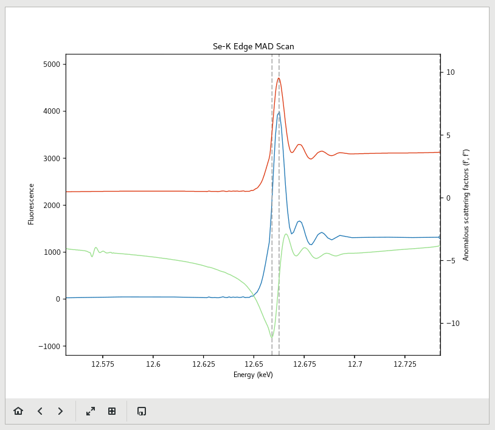
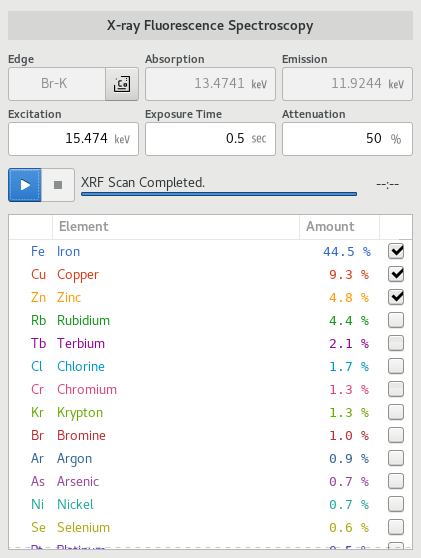

========
Scans
========

.. contents:: Table of contents
    :depth: 1
    :local:

The Scans View is the primary location for spectroscopic measurements such as MAD Scans, X-Ray fluorescence scans,
and X-Ray Absorption spectroscopy Scans.

.. figure:: scans.svg
    :align: center
    :width: 100%
    :alt: MxDC Scans View

    Scans View

It is divided in to two main regions. The Scan configuration region is on the left of the view, while the Scan plot is
on the right. The configuration area is further divided into two several regions. From top to bottom, you have the
Scan Mode selector, scan parameters and Control area, Scan results table and the feed back area.  The scan parameters
and results area may vary depending on the selected scan mode.

Edge Selector
-------------

.. image:: edge-selector.png
    :align: center
    :alt: Edge Selector

The Edge selector is popup dialog used for selecting absorption edges. It replaces the periodic table tool in previous
MxDC versions. To activate the selector, click the button to the right of the Edge parameter, then click on
the element of interest. Available edges for the selected element will be indicated at the top of the periodic table.
Clicking on an available edge will select it and update the entry.

Scan Plot
---------

.. image:: scan-plot.png
    :align: center
    :alt: Scan Plot

The Scan Plot displays a plot of the results from the most current scan. You can use the controls below the plot
to adjust or manipulate the plot.  You can also use the save button to save an image of the scan.

MAD Scans
---------

.. image:: mad-scans.png
    :align: center
    :alt: MAD Scans

To perform a MAD scan, select the MAD Scan mode, select the desired absorption edge using the Edge Selector, set
the exposure time and attenuation as desired and click the start button to initiate the scan.  Once the scan is complete,
it will be analyzed automatically using CHOOCH, and the results will be plotted and added to the results table.

To acquire a MAD dataset according to the results of a MAD scan, select the appropriate scan on the results table, and
then click the *Use Strategy* button below the results table.  This will add runs for each MAD energy to the interactive
data acquisition tool on the Data page.

XRF Scans
---------

To perform an XRF scan, select the XRF Scan mode, select the desired excition energy, the exposure time and the
attenuation. The Excitation energy can also be set by selecting a desired absorption edge using the edge-selector; a
suitable value for the excitation energy will then be calculated. Click the start button to initiate the scan.
Once the scan is complete, it will be analyzed automatically and results will be plotted and added to the results table.

Elements which were identified with high confidence will be annotated on the plot. Use the toggle-buttons in the results
table to toggle the annotations on the plot.

XAS Scans
---------

.. image:: xas-scans.png
    :align: center
    :alt: XAS Scan

To perform an X-ray Absorption Spectroscopy scan, select the XAS Scan mode, then select the desired absorption edge using
the Edge Selector. Set the exposure time, attenuation, number of scans and k-max as desired, then click the start button
to initiate the scan.  The scans will be added to the results table as each scan is completed.

.. image:: xas-plots.png
    :align: center
    :alt: XAS Plots
