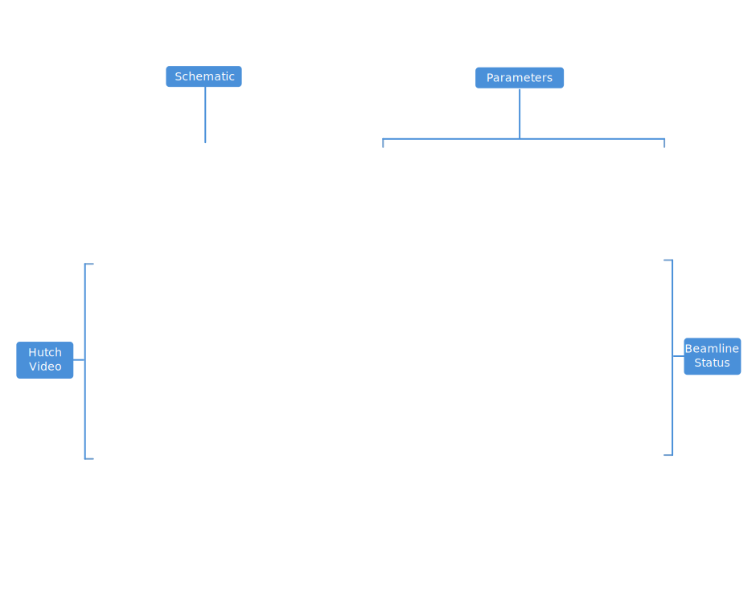
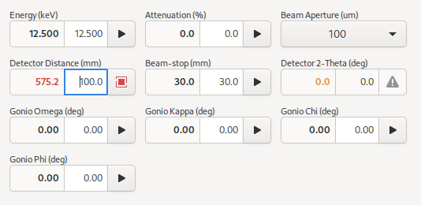
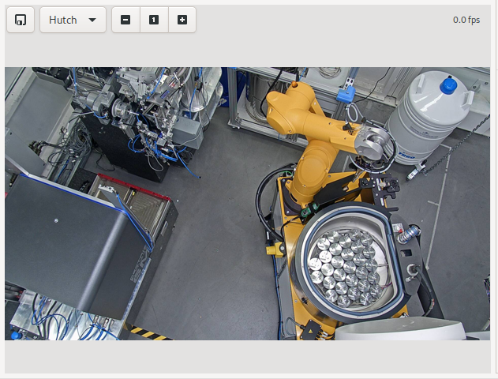
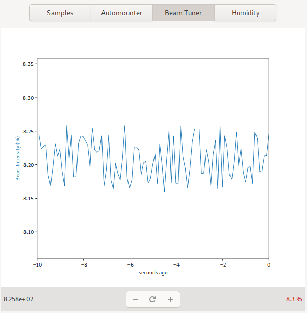
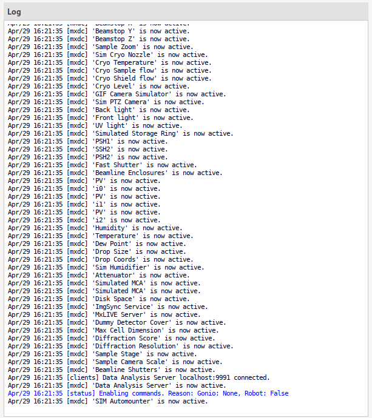
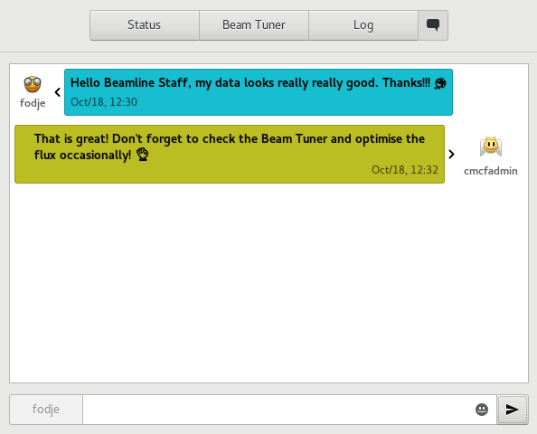

Setup
=====

The Setup View allows users to view, adjust and diagnose general beamline parameters outside of the context of an experiment.

    Screenshot of the Setup View

Device Parameters
-----------------
The device parameters are shown on the top-right hand corner of the Setup View. The exact parameters available may
vary with beamline but usually include, *energy*, beam *attenuation*, *beam aperture*, *detector distance*, *beam stop
distance* and *goniometer Omega* angle.  Where applicable, the current value is displayed on the left and a new value
can be entered on the right.  A button allows the parameter to be applied. This operation may cause the device to move
if it is a motor and feedback will be provided while it moves. The motion can also be stopped using the button.

The image above shows a screenshot of the Device Parameters. The detector distance is currently moving to the requested
position of 100 mm, therefore the current position is shown as red, and the button icon is a red animated square.
Clicking on the button will issue a stop command for the detector.  The beam aperture parameter is
a drop-down menu showing the possible values. The detector two-theta angle is in an error state.

Hutch Video
-----------
The Hutch Video Feed is a Pan-Tilt-Zoom Camera inside the experimental enclosure (hutch). This alows the user
to inspect the hutch remotely.

The camera can be controlled by clicking on the image to re-center the view, or by selecting pre-defined positions
from the *Presets* drop-down menu.

Beamline Status
---------------
The beamline status shows the status of various essential components on the beamline and allows users to quickly
diagnose problems on the beamline.

.. image:: images/diagnostics.png
    :align: center
    :alt: Beamline Status

Each entry on the list consists of an icon which conveys the state
(*Good, Bad, Warning, unknown*), a description of the component, and descriptive text about the current state.  The color
of the icon changes from blue to green to orange to red as the component changes from *unknown* to *good* to
*warning* to *error*.  In most cases, data acquisition can only proceed reliably if all components are *good*. In
some cases, it may be acceptable to proceed with some components in the *warning* state. Always cross-check with
beamline staff if in doubt.

Beam Tuner
----------
The beam tuner shows the current beamline flux as a percentage of the current expected flux. On some beamlines, it
also allows the beam tuning to be adjusted.

The plus and minus buttons can be used to tune the beam when applicable. Pressing and holding the button, allows
allows for continuous tuning in the given direction until it is released. This is usually easier for large adjustments
than multiple-clicking. Where applicable, the reset button can be used to reset the beam tuner.

Log
---
The Log displays log messages from MxDC. The messages are color-coded based on importance.

Chat
----
The Chat tool provides a simple mechanism for instant communication between users and staff, when staff are
available on the beamline. This supplements rather than replaces existing email and phone methods of communication

Messages can be composed using the entry at the bottom of the tool, and submitted using the send icon, or by pressing
return in entry. The chat functionality is only available when MxDC is running and staff are using
the MxDC Hutch Application.

